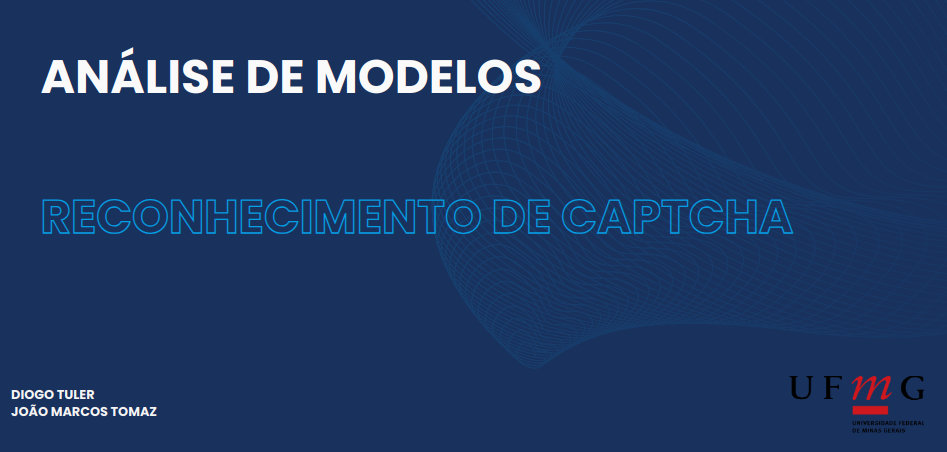

The goal of this project was to implement two distinct methods for captcha recognition. The initial approach employed the HOG technique alongside a diverse array of classifiers. In contrast, the second method leveraged convolutional neural networks (CNNs) to enhance accuracy significantly in this specific task. 

 
  